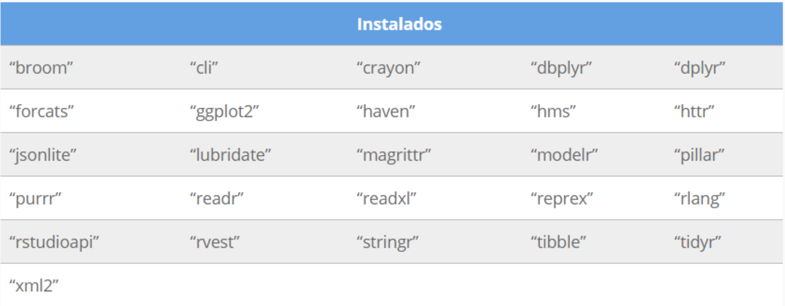
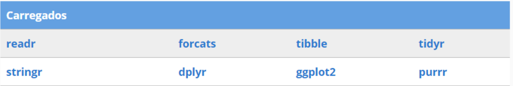
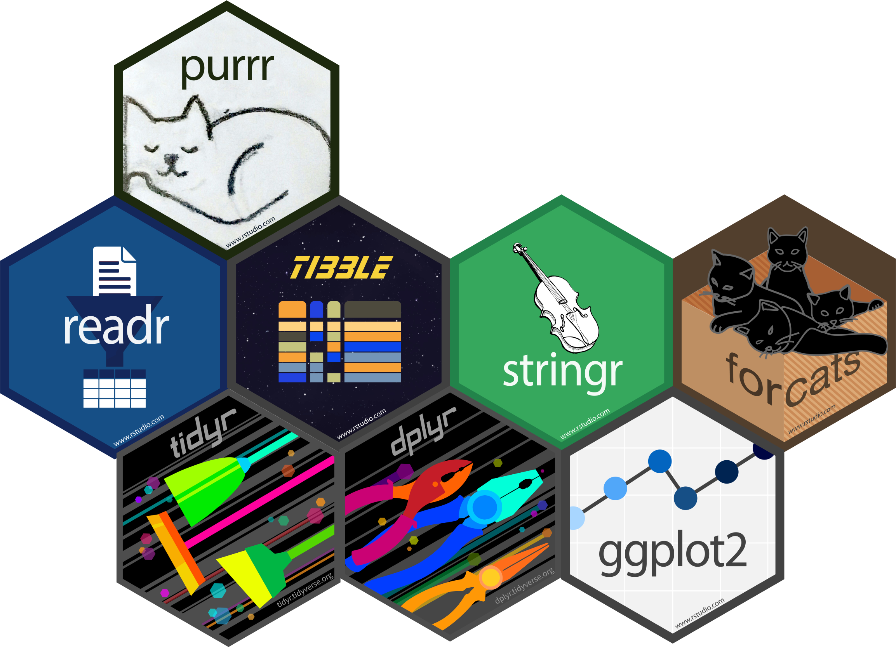
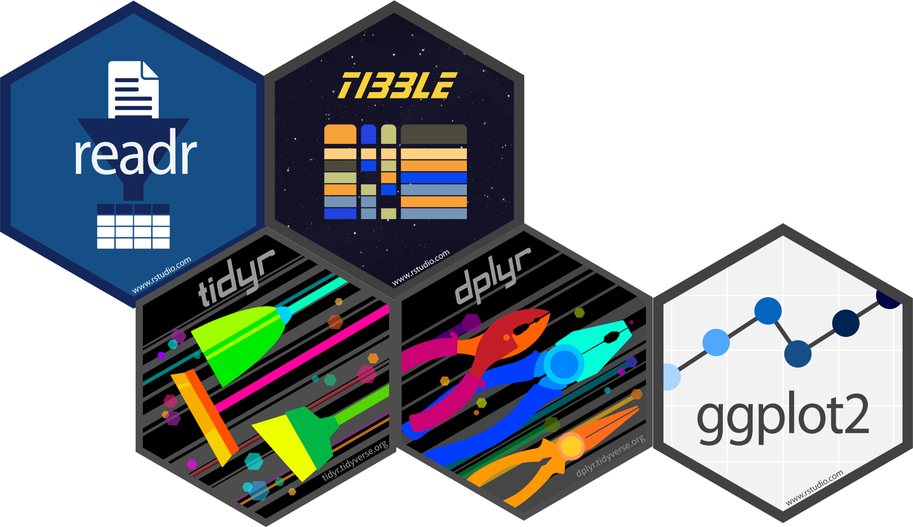
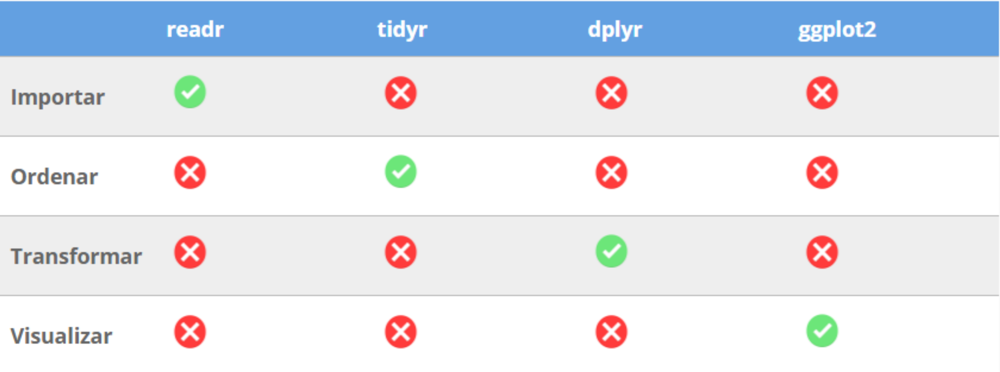

```{r setup, include=FALSE}
options(htmltools.dir.version = FALSE)
knitr::opts_chunk$set(
  fig.width=9, fig.height=3.5, fig.retina=3,
  out.width = "100%",
  cache = FALSE,
  echo = TRUE,
  message = FALSE, 
  warning = FALSE,
  fig.show = TRUE,
  hiline = TRUE
)
library(tidyverse)
```

```{r xaringan-themer, include=FALSE, warning=FALSE}
library(xaringanthemer)
style_duo_accent(
  primary_color = "#5E81AC",
  secondary_color = "#2E3440",
  inverse_header_color = "#A3BE8C"
)
xaringanExtra::use_tile_view() # para overwiew
xaringanExtra::use_scribble()  # para escrever na apresentação
xaringanExtra::use_clipboard() # para copiar códigos
xaringanExtra::use_panelset()  # para abas nos slides
xaringanExtra::use_extra_styles(
  hover_code_line = TRUE,         #<<
  mute_unhighlighted_code = TRUE  #<<
)
```

class: about-me, middle, center

[](https://github.com/icaro-freire/estat_2020.1) </br>
[**Estat_2020.1**](https://github.com/icaro-freire/estat_2020.1)

---
# Estabilidade vs Flexibilidade

- `R` é uma **linguagem** e **ambiente** de programação estatística

--

- É um projeto amplo e muito bem estabelecido.

--

- Essa _estabilidade_ da linguagem `R` é um dos aspectos buscados por seus desenvolvedores.

--

- Como *ambiente de programação*, o `R` permite que usuários desenvolvam seus próprios pacotes: aí está sua _flexibilidade_.

--

.pull-left[
### Por que criar um pacote em R?

- Automatizar certos procedimentos usuais (repetitivos); 

- Simplificar um conjunto de procedimentos que as funções do `R Base` disponibilizam;

- Preferências individuais.
]

--

.pull-right[
### Qual é um pacote popular para análise de dados?

```{r, echo=FALSE, out.width="20%", fig.align="center"}
knitr::include_graphics("img/tidyverse.png")
```
]

---
class: inverse center middle

# Tidyverse

---
name: tidyverse
background-image: url(img/tidyverse.png)
background-size: 90px
background-position: 1020px 60px

# O que é o Tidyverse?

--

> O tidyverse é um conjunto de pacotes que funcionam em harmonia porque compartilham representações de dados comuns e design de API. 
> O pacote tidyverse é projetado para facilitar a instalação e o carregamento de pacotes principais do próprio tidyverse em um único comando.

--

- Ou seja, o Tidyverse é um pacote que _instala_ e _carrega_ outros pacotes.

--

.pull-left[
- Ele instala cerca de 26 pacotes
]

--

.pull-right[
- Mas, só carrega 8 pacotes diretamente!
]

--

.pull-left[
```{r, echo=FALSE}

```
]

--

.pull-right[
```{r, echo=FALSE}

```

]

---

# Aqueles que são carregados ...

--

.pull-left[
```{r, echo=FALSE}

```
]

--

.pull-right[
- [**readr**][LER]: para importação de dados (`.csv`, dentre outras variações);
- [**stringr**][STR]: para _strings_, ou seja, manipulação de fragmentos de texto;
- [**forcats**][CATS]: para manipular variáveis categóricas (qualitativas);  
- [**tibble**][TIB]: uma melhora substancial nos antigos _data frames_;
- [**tidyr**][TIDY]: para organização dos dados (pivotagem de dados);
- [**dplyr**][DPLY]: para manipulação de dados (limpeza, transformação, etc.);
- [**ggplot2**][GRAF]: para visualização de dados (graficos em alto nível);
- [**purrr**][PURR]: para programação funcional.

[LER]:  https://readr.tidyverse.org/
[CATS]: https://forcats.tidyverse.org/
[PIPE]: https://magrittr.tidyverse.org/
[TIB]:  https://tibble.tidyverse.org/
[TIDY]: https://tidyr.tidyverse.org/
[STR]:  https://stringr.tidyverse.org/
[DPLY]: https://dplyr.tidyverse.org/
[GRAF]: https://ggplot2.tidyverse.org/
[PURR]: https://purrr.tidyverse.org/
]

---

# Aqueles que realmente vamos usar!

--

```{r, echo=FALSE, out.width="60%", fig.align="center"}

```

---

class: inverse center middle

# Tibble

---
name: tibble
background-image: url(img/tibble.png)
background-size: 90px
background-position: 1020px 60px

# Algo sobre Tibble

--

### O pacote `tibble` modifica a ideia dos `data frames` (do `R Base`)

--

- Evita coerções indesejadas de alguns elementos para vetor;

--

- Mostra, no console, de forma mais enxuta o conjunto de dados.

--

```{r, echo=FALSE, out.width="40%", fig.align='center'}
knitr::include_graphics("img/df-dt.png")
```


---
template: tibble

## Data Frame

```{r, echo=FALSE}
iris
```

---
template: tibble

## Tibble

```{r, echo=FALSE}
iris_tb <- as_tibble(iris) 
iris_tb
```

---
class: inverse center middle

# Pipe `%>%` 

---
name: pipe
background-image: url(img/pipe.png)
background-size: 90px
background-position: 1020px 60px

# Qual a ideia do ` %>% `?

--

```{r, echo=FALSE, out.width="50%", fig.align='center'}

```


--

- escrever o encadeamento do código como pensamos; 

--

- bem como escrevê-lo em etapas bem delimitadas, trazendo clareza em cada linha de código.

---

template: pipe

.pull-left[
- Lembram das funções compostas?
$$h(g(f(x)))$$
- Como pensamos?
  1. Pegue o $x$, **então**
  1. Avalie em $f$, **então**
  1. Avalie $f(x)$ em $g$, **então**
  1. Avalie $g(f(x))$ em $h()$
  
```{r, echo=FALSE, out.width="50%", fig.align='center'}
knitr::include_graphics("img/diagram.png")
```

]

--

.pull-right[
- Usando o ` %>% ` ficaria assim:

```{r, eval=FALSE}
x %>% f() %>% g() %>% h()
```

- Na prátrica, escrevemos assim:

```{r, eval=FALSE}
x %>% 
  f() %>% 
  g() %>% 
  h()
```

- Onde:
  * $x$ é um conjunto de dados no formato `tibble`
  * $f, g$ e $h$ são algumas das funções dos pacotes do `tidyverse`.
]

---
template: pipe

.pull-left[
- Por exemplo, se `mpg` é nosso conjunto de dados, suponha que eu queira fazer os seguintes procedimentos:

1. **filtrar** (_filter_) os carros que rodem acima de 15 milhas por galão e abaixo de 35 milhas por galão, na estrada (`hwy`);
1. **modificar** (_mutate_) a variável `hwy` criando uma coluna, por nome `km`, que transforma milhas em km (1 mi = 1.60 km, aproximadamente);
1. **selecionar** (_select_) essas milhas em km e a classe do carro (`class`)
1. **Plotar** (_ggplot_) um bloxplot com transparência de 50% (`alpha = 0.5`), comparando essas classes de carros com as kilometragens espalhadas pelo gráfico (`geom_jilter`).
]

--

.pull-right[
- O código `R` ficaria assim:

```{r, eval=FALSE}
mpg %>% 
  filter(hwy > 15  & hwy < 30) %>% 
  mutate(km = hwy * 1.60) %>% 
  select(class, km) %>% 
  ggplot(aes(class, km, fill = class)) +
  geom_boxplot(alpha = 0.5) +
  geom_jitter(aes(color = class))  
```
]

---
- Apenas por curiosidade, o código abaixo produz o que se segue.

```{r}
mpg %>% 
  filter(hwy > 15  & hwy < 30) %>% 
  mutate(km = hwy * 1.60) %>% 
  select(class, km) %>% 
  ggplot(aes(class, km, fill = class)) +
  geom_boxplot(alpha = 0.5) +
  geom_jitter(aes(color = class))  
```

---

class: inverse center middle

# Fluxo de Trabalho
# na
# Análise de Dados

---
# Fluxo de Trabalho

- Lembram dessa figura?

```{r, echo=FALSE}
knitr::include_graphics("img/fluxo.svg")
```

---

# Fluxo e Pacotes 

```{r, echo=FALSE, out.width="70%", fig.align='center'}

```

- Na etapa de **Modelagem** poderíamos usar os pacotes [**broom**](https://broom.tidymodels.org/) ou [**modelr**](https://modelr.tidyverse.org/), bem como o conjunto de pacotes do [**Tidymodel**](https://www.tidymodels.org/); mas, não será objetivo desse curso!

- E, na etapa de **Comunicar**, poderímos usar as inúmeras vertentes do [**R Markdown**](https://rmarkdown.rstudio.com/gallery.html).

---
class: inverse center middle

# Por que usar o Tidyverse?

---

## Alguns argumentos

--

.pull-left[

- Filosofia de análise

- Práticas que "tentam facilitar uma conversa entre um ser humano e um computador sobre dados"

- Facilitam a usabilidade (principalmente para quem está começando)

- Agregam no processamento dos dados.
    + escrever para que humanos "comuns" (fora da área de programação) usem
    + fazer que o computador processe adequadamente os dados.
]

--

.pull-right[

- Pilares da filosofia `tidy`:
  
  1. Reutilização de estruturas de dados já existentes;
  2. Composição entre funções de forma simples, com o ` %>% `;
  3. Utilização da [Programação Funcional](https://pt.wikipedia.org/wiki/Programa%C3%A7%C3%A3o_funcional#:~:text=Em%20ci%C3%AAncia%20da%20computa%C3%A7%C3%A3o%2C%20programa%C3%A7%C3%A3o,mudan%C3%A7as%20no%20estado%20do%20programa.);
  4. Feito para humanos
  
- Ao aprender a estrutura de um único pacote do `tidyverse`, isso facilitará o aprendizado de outros pacotes da mesma família;
- Ajuda de uma grande comunidade de usuários do pacote
]
---
class: center, middle

# Fim!

##### Veja atualizações na página de nossa disciplina no GitHub:

[](https://github.com/icaro-freire/estat_2020.1) </br>
[**Estat_2020.1**](https://github.com/icaro-freire/estat_2020.1)

