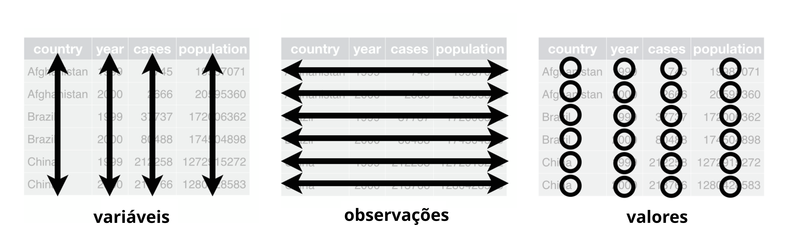

```{r setup, include=FALSE}
options(htmltools.dir.version = FALSE)
knitr::opts_chunk$set(
  fig.width=9, fig.height=3.5, fig.retina=3,
  out.width = "100%",
  cache = FALSE,
  echo = TRUE,
  message = FALSE, 
  warning = FALSE,
  fig.show = TRUE,
  hiline = TRUE
)
library(tidyverse)
```

```{r xaringan-themer, include=FALSE, warning=FALSE}
library(xaringanthemer)
style_duo_accent(
  primary_color = "#5E81AC",
  secondary_color = "#2E3440",
  inverse_header_color = "#A3BE8C"
)
xaringanExtra::use_tile_view() # para overwiew
xaringanExtra::use_scribble()  # para escrever na apresentação
xaringanExtra::use_clipboard() # para copiar códigos
xaringanExtra::use_panelset()  # para abas nos slides
xaringanExtra::use_extra_styles(
  hover_code_line = TRUE,         #<<
  mute_unhighlighted_code = TRUE  #<<
)
```

class: about-me, middle, center

[](https://github.com/icaro-freire/estat_2020.1) </br>
[**Estat_2020.1**](https://github.com/icaro-freire/estat_2020.1)

---
class: inverse center middle

```{r, echo=FALSE, fig.align='center', out.width='30%'}
knitr::include_graphics("img/tidyr.png")
```
---
## O que são Dados Organizados?
.panelset[
.panel[.panel-name[Organizados?]
```{r, echo=FALSE, fig.align='center', out.width='30%'}
dt <- read_csv("https://raw.githubusercontent.com/icaro-freire/dados_csv/main/dados/csv/notas_disciplina.csv")
knitr::kable(head(dt, 10))
```
]
.panel[.panel-name[Natureza dos Dados]
```{r, echo=FALSE, fig.align='center', out.width='40%'}
knitr::include_graphics("img/real.png")
```
]
.panel[.panel-name[Dados Tidy]
```{r, echo=FALSE, fig.align='center', out.width='70%'}

```

- Cada coluna é uma variável;
- Cada linha é uma observação;
- Em cada célula está uma única observação.
]

.panel[.panel-name[Organizados!]
```{r, echo=FALSE}
dt_tidy <- tidyr::pivot_longer(dt, !Curso, names_to = "ano", values_to = "notas")
knitr::kable(head(dt_tidy, 10))
```
]
<!-- x -->
]
---

## Pivotagem dos Dados
.panelset[
.panel[.panel-name[1º Modo]
- Negando a coluna que não queremos mudar

```{r, eval=FALSE}
dados %>%                        # `dados` é o nosso dataset
  pivot_longer(
    !Curso,                      # excluíndo da pivotagem a variável `Curso`
    names_to = "variavel-nova",  # colocando o nome da variável independente
    values_to = "valores-novos"  # nome da variável dependente
  )
```

]
.panel[.panel-name[2º Modo]
- Escolhendo as colunas que queremos mudar

```{r, eval=FALSE}
dados %>%                
  pivot_longer(
    a:b,                # selecionando as colunas de "a" a "b"
    names_to = "ano",    
    values_to = "media" 
  )
```

]
.panel[.panel-name[Prática]
```{r, echo=FALSE, out.width='50%', fig.align='center'}
knitr::include_graphics("img/fall.gif")
```

]
]

---
class: center, middle

# Fim!

##### Veja atualizações na página de nossa disciplina no GitHub:

[](https://github.com/icaro-freire/estat_2020.1) </br>
[**Estat_2020.1**](https://github.com/icaro-freire/estat_2020.1)
